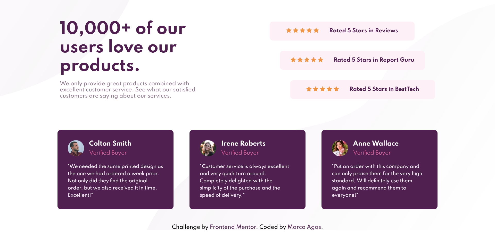

# Frontend Mentor - Social proof section solution

This is a solution to the [Social proof section challenge on Frontend Mentor](https://www.frontendmentor.io/challenges/social-proof-section-6e0qTv_bA). Frontend Mentor challenges help you improve your coding skills by building realistic projects. 

## Table of contents

- [Overview](#overview)
  - [The challenge](#the-challenge)
  - [Screenshot](#screenshot)
  - [Links](#links)
- [My process](#my-process)
  - [Built with](#built-with)
  - [What I learned](#what-i-learned)
  - [Continued development](#continued-development)
  - [Useful resources](#useful-resources)
- [Author](#author)

## Overview

### The challenge

Users should be able to:

- View the optimal layout for the section depending on their device's screen size

### Screenshot

### Links

- Solution URL: [Add solution URL here](https://your-solution-url.com)
- Live Site URL: [Add live site URL here](https://your-live-site-url.com)

## My process

### Built with

- Semantic HTML5 markup
- CSS custom properties
- Flexbox
- CSS Grid
- Mobile-first workflow

### What I learned

This was a real tough one! It looked easy in the beginning, so I decided to try a mobile-first approach. This meant doing all the mobile layouts first. However, the desktop version had a unique layout, and I didn't think of seeing how a simple version that would allow less css to be used.

I learned here to really focus on mobile-desktop transition, and if there's an easier way of coding.

To see how you can add code snippets, see below:

### Continued development

I'd eventually like to rewrite my code in a cleaner fashion, and maybe add some css/js animations.

### Useful resources

- [CSS Tricks Flexbox](https://css-tricks.com/snippets/css/a-guide-to-flexbox/)

## Author

- Website - [The JC](https://www.thejc.co.za)
- Frontend Mentor - [@marcojhb](https://www.frontendmentor.io/profile/yourusername)
- Twitter - [@marcojhb](https://www.twitter.com/yourusername)